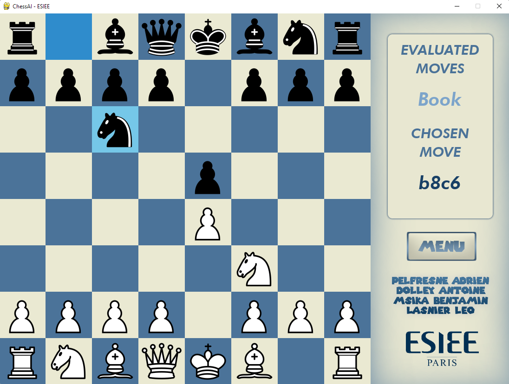

# ChessAI : Python AI and GUI 
## Using book moves, alpha-beta pruining and gaviota endgame Tablebase 

## Installation

### If you do not have the following dependencies : 

    pygame
    numpy
    
### Install them for the program to run

    python -m pip install pygame
    python -m pip install numpy

### Clone the repo
    git clone https://github.com/dirdr/ChessAI
    
### Go to the repo root

    cd ChessAI
    
### Run it
    
    python ChessAI.py
